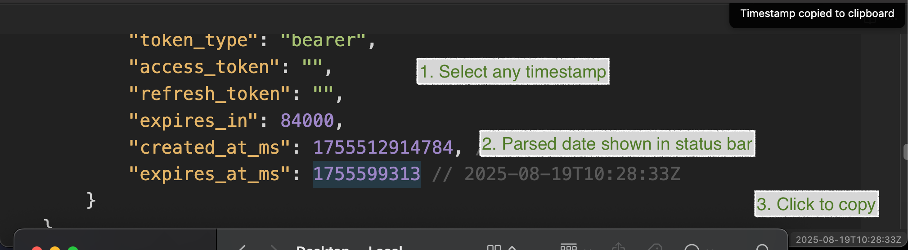

# Selection Parser

An Obsidian plugin that automatically detects and parses Unix timestamps from selected text.

**Features:**
- Automatically detects Unix timestamps (seconds or milliseconds) in selected text
- Displays parsed timestamps in ISO format in the status bar
- Click status bar to copy formatted timestamp to clipboard
- Configurable debug logging via plugin settings
- Performance optimized with debounced selection events

> **Note:** This plugin was primarily written by an AI agent (Claude) with human guidance.

## Development Setup

Quick starting guide for new plugin devs:

- Check if [someone already developed a plugin for what you want](https://obsidian.md/plugins)! There might be an existing plugin similar enough that you can partner up with.
- Fork or clone this repository to get started with plugin development.
- Clone the repo to a local development folder. For convenience, you can place this folder in your `.obsidian/plugins/obsidian-selection-parser` folder.
- Install NodeJS, then run `npm i` in the command line under your repo folder.
- Run `npm run dev` to compile your plugin from `main.ts` to `main.js`.
- Make changes to `main.ts` (or create new `.ts` files). Those changes should be automatically compiled into `main.js`.
- Reload Obsidian to load the new version of your plugin.
- Enable plugin in settings window.
- For updates to the Obsidian API run `npm update` in the command line under your repo folder.

## Releasing new releases

- Update your `manifest.json` with your new version number, such as `1.0.1`, and the minimum Obsidian version required for your latest release.
- Update your `versions.json` file with `"new-plugin-version": "minimum-obsidian-version"` so older versions of Obsidian can download an older version of your plugin that's compatible.
- Create new GitHub release using your new version number as the "Tag version". Use the exact version number, don't include a prefix `v`.
- Upload the files `manifest.json`, `main.js`, `styles.css` as binary attachments. Note: The manifest.json file must be in two places, first the root path of your repository and also in the release.
- Publish the release.

> You can simplify the version bump process by running `npm version patch`, `npm version minor` or `npm version major` after updating `minAppVersion` manually in `manifest.json`.
> The command will bump version in `manifest.json` and `package.json`, and add the entry for the new version to `versions.json`

## How to use

- Clone this repo.
- Make sure your NodeJS is at least v16 (`node --version`).
- `npm i` to install dependencies.
- `npm run dev` to start compilation in watch mode.
- `npm test` to run tests.

## Manually installing the plugin

- Copy over `main.js`, `styles.css`, `manifest.json` to your vault `VaultFolder/.obsidian/plugins/obsidian-selection-parser/`.
